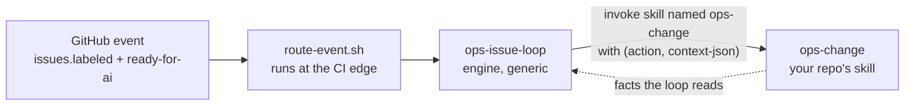
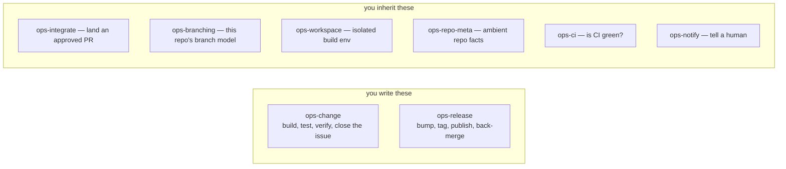
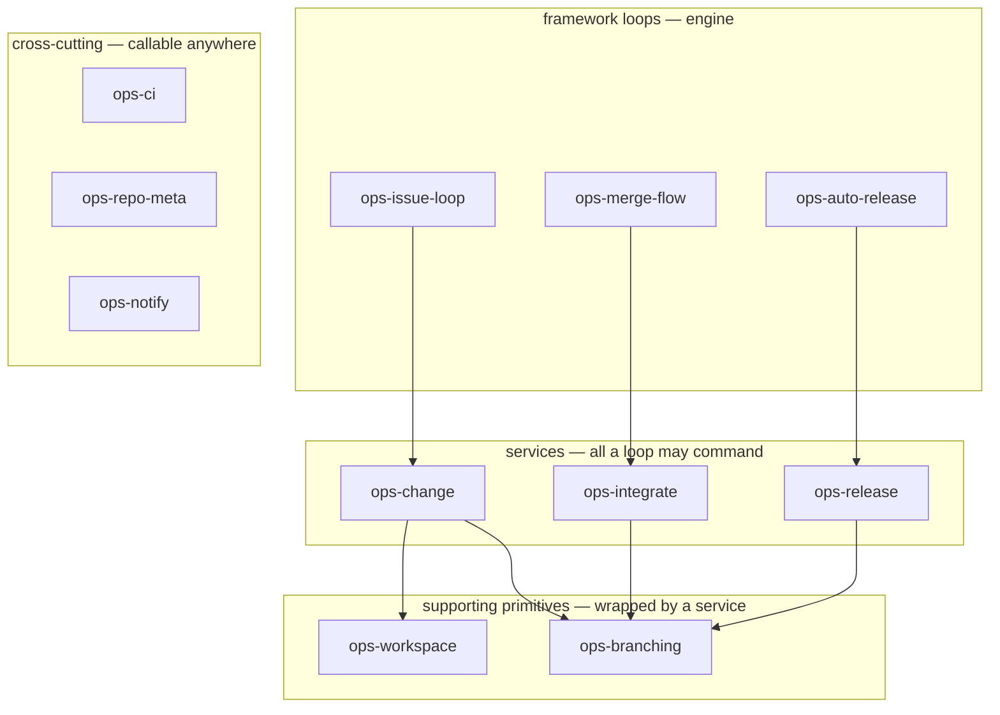

# umbraco-ai-ops

The **generic engine** for AI-driven issue automation across Umbraco products. It turns
a `ready-for-ai` GitHub backlog into CI-green, reviewed, merged PRs — and feeds its own
improvement back into the repos it works.

This repo is product-**agnostic**. It knows *how to run the loop*; it does **not** know how
to build any one product. Each consumer supplies exactly two things:

1. a **build skill** (the per-issue how-to for that product — a repo-owned skill it
   overrides), and
2. a small **config block** (repo facts: where issues live, where PRs open, which CI, …).

The engine never contains build steps. It **defers** to the repo's build skill, which it
locates by name via the config (`playbook`); the repo **owns and edits** that skill. There is
no injected "slot" and no same-name shadowing of an engine skill — override = the repo owns
its skill; defer = the engine finds it via a config pointer.

Extracted from the [`umbraco-mcp-ops`](https://github.com/hifi-phil/umbraco-mcp-ops)
prototype, which proved the model on Claude Code web routines.

## Who consumes it, and how

Consumer shape follows **repo cardinality**:

| Consumer | Shape | Where its build skill + config live |
|----------|-------|----------------------------------|
| **Umbraco.Forms** | single product, one repo | committed in the repo's own `.claude/skills/` (in-repo) |
| **Umbraco.Automate** | single product (multi-package), one repo | committed in the repo's own `.claude/skills/` (in-repo) |
| **MCP server family** | many repos, one toolchain | one shared consumer repo (`umbraco-mcp-ops`), delivered like the engine |

> **One product = one repo → consumer half lives in-repo.**
> **One product family = many repos → consumer half lives in one shared repo**, to avoid
> duplicating an identical build skill across the family.

## Plugins

Installed from this marketplace (`.claude-plugin/marketplace.json`):

| Plugin | What it is |
|--------|------------|
| **ops-setup** | Interactive onboarding — `/umbraco-ops-setup` detects the repo's branching/CI/release setup, confirms via the question tool, and generates `.claude/ai-ops.yml` + the build-skill scaffold + caller workflow(s). Run it first. |
| **issue-loop-core** | The orchestration engine (queue → `/goal` → cap-3 dispatch → review phase → stop conditions). Defers to the repo's own build skill (located via the `playbook` config pointer); owns orchestration only. Bundles `rework-loop`. |
| **github-ops** | GitHub work in both environments (`gh`/`git` local, `mcp__github__*` on web) **+ a CI-provider abstraction** (`github-checks`, `azure-pipelines`). Required by every loop. |
| **loop-dispatch** | One-routine-per-repo event router (`route-event.sh`). Supports a `target_repo` distinct from the event's repo (cross-repo-issues case, e.g. Forms). |
| **merge-flow** | Gated auto-merge on the `auto-merge` label once CI-green + conflict-free. |
| **learning** | The self-learning machinery: capture hooks → `proto-learning` issues → `triage-learnings`. Mechanism generic; inbox + routing are config. |
| **release-flow** | Branching/release/dev-sync (gitflow vs main-only). **Reference/default only** — Forms and Automate override with their own release skills. |
| **dotnet-web-runtime** | Cloud-env setup so a .NET product can run as a web routine (NuGet-feed proxy / 401 fix). |

## Getting started (onboarding a repo)

1. **Install the engine** in the target repo's workspace:
   `/plugin marketplace add umbraco/umbraco-ai-ops`, then install the plugins.
2. **Run `/umbraco-ops-setup`.** It investigates the repo (branching model from git history,
   CI host, release approach), confirms and fills the gaps with you via the question tool,
   and writes `.claude/ai-ops.yml`, a build-skill scaffold, and the caller workflow(s).
3. **Do the manual steps it reports** — create the labels, add the CI auth (a read-only ADO
   PAT for `azure-pipelines` repos) + egress, and stand up the routine via `new-loop-routine`.
4. **Review + commit** the generated files (fill any build-skill TODOs first).

Nothing is product-specific in the engine — everything the repo does differently lives in
its own `.claude/ai-ops.yml` and, for bespoke release/branching, an applied-repo skill named
in `branching.release_skill`.

## How a consumer links to the engine

Linkage is **by config pointer + skill name** — `issue-loop-core` locates the repo's build
skill via `ai-ops.yml` (`playbook`) and follows it; everything calls `github-ops` by name.
Nothing is copied, and nothing relies on same-name shadowing.

- **Local:** `/plugin marketplace add umbraco/umbraco-ai-ops` → install the engine plugins.
  In-repo consumer skills load as project skills automatically; the MCP family loads its
  shared skills from `umbraco-mcp-ops`.
- **Web routines (primary runtime):** `scripts/cloud-skill-sync.sh` (env Setup script)
  delivers the engine to `$HOME/.claude/skills`. Single-product repos add nothing — a
  routine loads the checked-out repo's committed `.claude/skills/` and `.claude/settings.json`
  hooks natively. **Caveat:** routines clone the **default branch** unless the prompt says
  otherwise, so keep one canonical build skill on the default branch and make it
  **line-aware at runtime** (it detects the base branch) — don't fork per-branch skill copies.

## The config contract

Each consumer supplies two things: a **build skill** (its per-issue how-to, repo-owned) and a
**config block** — the repo's `.claude/ai-ops.yml`, defined by **[`ai-ops.schema.json`](ai-ops.schema.json)**
with a worked example in **[`ai-ops.example.yml`](ai-ops.example.yml)**. `/umbraco-ops-setup`
writes it; every loop reads it. It covers `repos` (source/inbox/issue_link), `ci`
(provider + ADO org/project), `branching` (model/base/release_base/merge_strategy/
release_skill), `learning`, and the `playbook` name. Omit anything the engine auto-detects —
a plain same-repo gitflow repo needs almost nothing; anything bespoke is handed to the skill
named in `branching.release_skill`.

## Where this is going: capability skills

> **Target model, not shipped yet.** The config contract above is what the engine does *today*.
> It is being replaced by **convention**: each extension point becomes a skill named
> `ops-<capability>`, located by that name rather than by a config pointer. Plan, phases and open
> decisions: **[`docs/capabilities-migration-plan.md`](docs/capabilities-migration-plan.md)**.
> Shared terms: **[`docs/vocabulary.md`](docs/vocabulary.md)**.

### It's one interface

A generic loop reaches your repo by **invoking a skill by name**. That's the whole binding:



The skill's **name** is the address, the **action** is the verb, JSON goes in and facts come back.
No frontmatter to key on, no registry, no config pointer. Everything below is commentary on that
one arrow.

### You write two of them



Only `ops-change` and `ops-release` are **always** yours — they're the two nobody else can write,
because they're what your product actually does. The other six ship as engine defaults you override
only if you need something different. Learnings capture is engine machinery, not a per-repo
capability.

| Capability | What it does | Provided by |
|---|---|---|
| `ops-change` | build/test/verify one change, close the issue | **always the repo** |
| `ops-release` | version bump, tag, publish, back-merge | **always the repo** |
| `ops-integrate` | land an approved PR — the merge gates + the merge | engine default |
| `ops-branching` | open/merge PRs, start branches, own the branch model | engine default |
| `ops-workspace` | prepare + tear down an isolated build env | engine default |
| `ops-repo-meta` | ambient facts: identity, which repo fills which role | engine default, detection-backed |
| `ops-ci` | CI status + failing-build logs | engine default per CI provider |
| `ops-notify` | notify a human | engine default |

### Who may call what

Capabilities aren't a flat pool — each is exposed to a particular layer. The engine records that per
capability so review can enforce it:



**The missing arrows are the point.** Nothing reaches `ops-branching` except through a service, so
no loop ever holds a branch name or a merge strategy — it asks for an outcome ("merge this PR") and
branching decides. That one absence is what collapses the four places base-branch knowledge lives
today.

The capability set and who may call what are settled; the per-capability *actions* are argued out
against the catalog itself, so they live in the plan rather than here until `catalog.json` exists.

## Layout

```
.claude-plugin/
  marketplace.json         # marketplace manifest listing the plugins
.github/workflows/
  tests.yml                # hermetic CI gate: run every *.test.sh + jq-validate every JSON
  loop-dispatch.yml        # reusable runtime workflow consumers call (edge router -> fire routine)
plugins/
  <plugin>/                # one dir per plugin (skills/, agents/, scripts/, references/)
scripts/
  cloud-skill-sync.sh      # cloud-env Setup script: deliver the engine skills to a routine
```

## Status

**Work in progress** — scaffolding the engine by extracting and genericising the proven
`umbraco-mcp-ops` plugins, and migrating from the config contract to the capability model above.
Design, phases, open decisions and hazard register:
**[`docs/capabilities-migration-plan.md`](docs/capabilities-migration-plan.md)**.
