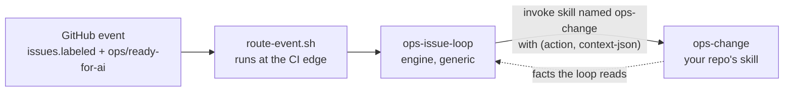
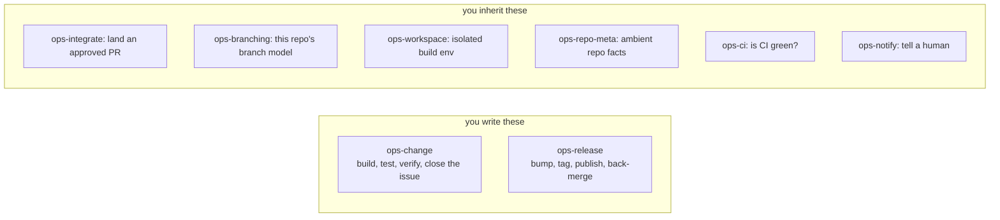
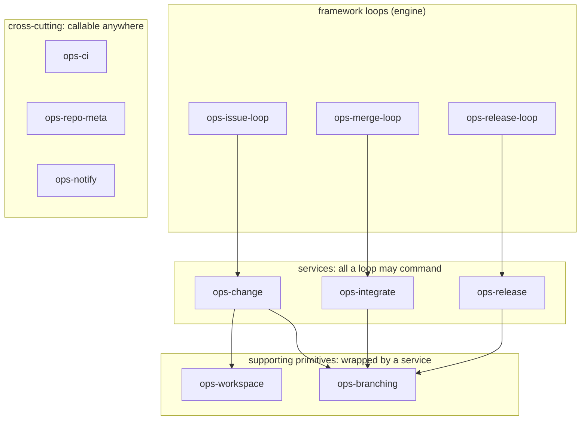

# umbraco-ai-ops

The **generic engine** for AI-driven issue automation across Umbraco products. It turns a
`ops/ready-for-ai` GitHub backlog into CI-green, reviewed, merged PRs. It also feeds what it learns
back into the repos it works on.

This repo is product-**agnostic**. It knows *how to run the loop*. It does **not** know how to
build any one product. Each consumer supplies **two skills it owns**:

1. **`ops-change`** — build, test and verify one change, and close the issue behind it.
2. **`ops-release`** — bump, tag, publish, put the branches back in step.

The engine holds no build steps of its own. A loop reaches your repo by **invoking a skill by
name** — `ops-change` — with an action and a JSON context. Nothing is injected into a slot,
nothing relies on one skill shadowing another, and there is no config pointer. Six more
capabilities ship as defaults you inherit and can override the same way.

Extracted from the [`umbraco-mcp-ops`](https://github.com/hifi-phil/umbraco-mcp-ops)
prototype, which proved the model on Claude Code web routines.

## Who consumes it, and how

Consumer shape follows **repo cardinality**:

| Consumer | Shape | Where its capability skills live |
|----------|-------|----------------------------------|
| **Umbraco.Forms** | single product, one repo | its own `.claude/skills/ops-change` + `ops-release` |
| **Umbraco.Automate** | single product (multi-package), one repo | its own `.claude/skills/`, same shape |
| **MCP server family** | many repos, one toolchain | one shared consumer repo (`umbraco-mcp-ops`), delivered like the engine |

> **One product = one repo → your two skills live in-repo.**
> **One product family = many repos → they live in one shared repo**, to avoid duplicating an
> identical `ops-change` across the family.

## Plugins

Installed from this marketplace (`.claude-plugin/marketplace.json`):

| Plugin | What it is |
|--------|------------|
| **ops-install** | Onboarding, and the proof it worked. `/ops-install` detects the repo's setup, reports capability coverage, scaffolds a stub for anything missing, installs the caller workflows and validates the routing. Run it first. |
| **ops-issue-loop** | The orchestrator: queue, dispatch up to three at once, stop at a green PR. It owns sequencing only and commands your `ops-change` for the work. Bundles `ops-rework-loop`. |
| **ops-learnings** | Self-learning. Read-only hooks file `ops/proto-learning` issues off the critical path; `ops-triage-loop` sweeps them weekly and routes each lesson to whoever owns it. |
| **github-ops** | All GitHub work, in both environments: `gh`/`git` locally, `mcp__github__*` on web. Also wraps the CI provider, either `github-checks` or `azure-pipelines`. Every loop needs it. |
| **loop-dispatch** | The event router, `route-event.sh`. One routine per repo. It can work in a different repo from the one that fired the event, which is what Forms needs. |
| **ops-capabilities** | The six capability skills you **inherit**: `ops-integrate`, `ops-branching`, `ops-workspace`, `ops-repo-meta`, `ops-ci`, `ops-notify`. Override one by shipping your own skill of the same name. |
| **ops-merge-loop** | Sweeps PRs labelled `ops/auto-merge` and hands each to `ops-integrate · land`. Scheduling only: every merge gate lives in the service. |
| **ops-release-loop** | Issue-triggered, CI-gated release. Commands the repo's own `ops-release` through plan → cut → publish → sync, with an Opus pre-publish review as the second gate. |

> **Not built yet, and not declared:** **dotnet-web-runtime** (cloud setup so a .NET product can
> run as a web routine, fixing the NuGet feed 401). It used to be listed in `marketplace.json`
> while pointing at a directory that did not exist, which would make `/plugin marketplace add`
> fail on the whole marketplace. It is re-declared when it exists.

## Getting started (onboarding a repo)

1. **Install the engine** in the target repo's workspace:
   `/plugin marketplace add umbraco/umbraco-ai-ops`, then install the plugins.
2. **Run `/ops-install`.** It reads the branching model out of git history, works out the CI host
   and release approach, then asks about anything it could not tell. It reports **capability
   coverage** and scaffolds a stub for whatever is missing — on a fresh repo that is `ops-change`
   and `ops-release`, the two that are always yours.
3. **Do the manual steps it lists.** Create the `ops/` labels. Add the routine secrets, and the
   CI credentials if CI is not GitHub checks. Then stand up the routine with `new-loop-routine`.
4. **Fill in the TODOs in the scaffolded skills, then review and commit.** A scaffold is not an
   implementation: the loops cannot run until those are done.

Nothing in the engine is product-specific, and there is no config file. Whatever your repo does
differently lives in a skill you own, named `ops-<capability>`.

## How a consumer links to the engine

**One thing does the linking: the skill's name.** `ops-issue-loop` invokes `ops-change`;
`ops-release-loop` invokes `ops-release`; everything reaches `github-ops` by its name. Nothing is
copied, nothing depends on one skill shadowing another, and no pointer has to be kept in step.

- **Local:** run `/plugin marketplace add umbraco/umbraco-ai-ops`, then install the engine
  plugins. A repo's own skills load automatically as project skills. The MCP family loads its
  shared skills from `umbraco-mcp-ops`.
- **Web routines**, the main runtime: `scripts/cloud-skill-sync.sh` runs as the environment Setup
  script and delivers the engine to `$HOME/.claude/skills`. Single-product repos need nothing
  extra. A routine picks up the checked-out repo's `.claude/skills/` and its
  `.claude/settings.json` hooks on its own.

> **Watch out:** a routine clones the **default branch** unless its prompt says otherwise. So keep
> one build skill on the default branch and have it work out the base branch at runtime. Do not
> fork a copy per branch.

## Capability skills

> **Where things stand.** The engine is on the capability model: the catalog exists, routing is
> base ⊕ overlay at the edge, every loop commands capabilities by name, the installer proves
> coverage, and the old central config is deleted. What is left is per-consumer work (Phase 6 —
> Forms' and Automate's own two skills) and evals (Phase 7). The plan is in
> **[`docs/capabilities-migration-plan.md`](docs/capabilities-migration-plan.md)**; shared terms
> are in **[`docs/vocabulary.md`](docs/vocabulary.md)**.

### It's one interface

A generic loop reaches your repo by **invoking a skill by name**. That's the whole binding:



The skill's **name** is the address. The **action** is the verb. JSON goes in and facts come back.
There is no frontmatter to key on, no registry and no config pointer. Everything below is
commentary on that one arrow.

### You write two of them



Only `ops-change` and `ops-release` are **always** yours. Nobody else can write them, because they
are what your product actually does. The other six ship as engine defaults. Override one only when
you need something different. Learnings capture is engine machinery, not a per-repo capability.

| Capability | What it does | Provided by |
|---|---|---|
| `ops-change` | build/test/verify one change, close the issue | **always the repo** |
| `ops-release` | version bump, tag, publish, back-merge | **always the repo** |
| `ops-integrate` | land an approved PR: the gates, then the merge | engine default |
| `ops-branching` | open/merge PRs, start branches, own the branch model | engine default |
| `ops-workspace` | prepare + tear down an isolated build env | engine default |
| `ops-repo-meta` | ambient facts: identity, which repo fills which role | engine default, detection-backed |
| `ops-ci` | CI status + failing-build logs | engine default per CI provider |
| `ops-notify` | notify a human | engine default |

### Who may call what

Capabilities are not a flat pool. Each one is exposed to a particular layer, and the engine records
which, so review can hold the line:



**The missing arrows are the point.** Nothing reaches `ops-branching` except through a service. So
no loop ever holds a branch name or a merge strategy. It asks for an outcome, "merge this PR", and
branching decides how. That one absence is what collapses the four places base-branch knowledge
lives today.

### The actions each one answers to

The capability is the address; the **action** is the verb. These come from
**[`catalog.json`](catalog.json)**, whose shape is set by
**[`catalog.schema.json`](catalog.schema.json)**. The action *names* are the contract: a capability
skill must implement exactly these and reject anything else.

> The table below is **generated**. Edit `catalog.json`, then run
> `scripts/catalog-to-readme.sh`. CI fails if the two drift apart.

<!-- BEGIN GENERATED: catalog-actions (scripts/catalog-to-readme.sh) -->
| Capability | Action | What it does |
|---|---|---|
| `ops-change` | `implement` | Make the change the issue asks for on a work branch, and push it. |
| `ops-change` | `verify` | Run this repo's build, tests and sanity checks against the change, and report pass or fail with enough detail for the caller to act on a failure. |
| `ops-change` | `close-issue` | Told that a PR has landed, work out which issue it was for and close that issue only once EVERY target line has landed — one logical change lands N times at N moments. |
| `ops-release` | `plan` | Turn the trigger into release facts: which line, which version, and which units of work the release contains. |
| `ops-release` | `cut` | Branch, bump the version files, write the changelog, and open the release PR. |
| `ops-release` | `publish` | Realize the release once its PR has landed: tag the commit, push the artifacts to their feed, and publish the release notes. |
| `ops-release` | `sync` | Put the line's branches back in step after a release, so the next change starts from what actually shipped. |
| `ops-integrate` | `land` | Check every gate, then merge, or decline with the reason. |
| `ops-branching` | `merge` | Merge a PR using whichever strategy this repo's model calls for. |
| `ops-branching` | `open-pr` | Open a PR from a work branch onto the correct base for its line, choosing that base internally. |
| `ops-branching` | `start-branch` | Create a work branch for a change, named to this repo's convention and rooted on the correct base for its line. |
| `ops-workspace` | `prepare` | Create the isolated workspace for a branch and leave it ready to build. |
| `ops-workspace` | `teardown` | Remove the workspace and everything it created, including any database or container. |
| `ops-repo-meta` | `identity` | Name the repo the loop is working in, and the labels and defaults it runs by. |
| `ops-repo-meta` | `topology` | Say which repo fills each of the four roles — `code` (required), `issues`, `releases` and `learnings`. |
| `ops-repo-meta` | `lines` | List the live lines, say which is primary, and give the port order. |
| `ops-ci` | `status` | Report the CI state of a PR: pending, green or red, and which checks produced that verdict. |
| `ops-ci` | `log` | Return the failing part of a failing build's log, trimmed to what is needed to diagnose it rather than the whole run. |
| `ops-notify` | `send` | Send one notification to a human through whichever channel this repo uses. |
<!-- END GENERATED: catalog-actions -->

Each catalogued action also carries a worked `example` context, which does double duty: the
installer scaffolds a stub from it and the eval suite is seeded from it. What an action *does* is
not enforced anywhere — no static types, no payload validation. Evals are the only behavioural
guard, which is the deliberate trade the spec makes.

## Layout

```
.claude-plugin/
  marketplace.json         # marketplace manifest listing the plugins
.github/workflows/
  tests.yml                # hermetic CI gate: run every *.test.sh + jq-validate every JSON
  loop-dispatch.yml        # reusable runtime workflow consumers call (edge router -> fire routine)
catalog.json               # the capability catalog: capabilities, actions, worked examples
catalog.schema.json        # its shape (a deliberate superset of the conformance spec's keys)
docs/                      # migration plan, the two design docs, the vocabulary
plugins/
  <plugin>/                # one dir per plugin (skills/, agents/, scripts/, references/)
scripts/                   # engine-wide scripts, not tied to one skill; each has its *.test.sh
  validate-catalog.sh      # enforce catalog.schema.json's rules in jq (hermetic CI has no validator)
  catalog-to-readme.sh     # regenerate this file's action table; --check fails on drift
```

> **Not here yet:** `scripts/cloud-skill-sync.sh`, referenced above as the cloud delivery
> mechanism, has not been ported from the prototype.

## Status

**Work in progress.** Two jobs at once: pulling the proven `umbraco-mcp-ops` plugins out and making
them generic, and moving from the config contract to the capability model above. The design, the
phases, the open decisions and the hazard register are all in
**[`docs/capabilities-migration-plan.md`](docs/capabilities-migration-plan.md)**.
