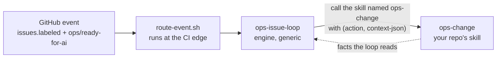
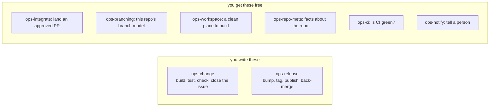
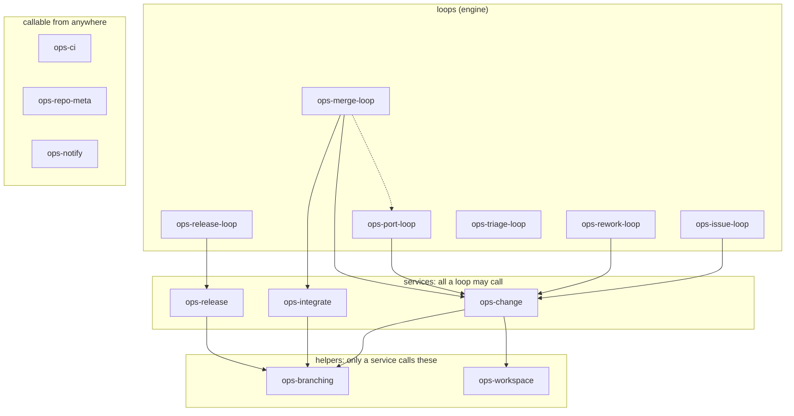

# umbraco-ai-ops

**DevOps for agents.**

An engine that turns a GitHub backlog into merged, released code. An agent does the work. A person
keeps the gates.

It does not know how to build any one product. It knows how to run the loop. Every repo that uses
it writes two skills of its own:

1. **`ops-change`**: build one change, test it, check it, close the issue.
2. **`ops-release`**: bump the version, tag it, publish it, put the branches back in step.

A loop reaches your repo by calling a skill by name. It passes in an action and a small bundle of
details. There is no config file, and no pointer that has to be kept up to date.

Six more jobs ship as defaults. You get those for free. Replace any one of them by writing a skill
with the same name.

Built from the [`umbraco-mcp-ops`](https://github.com/hifi-phil/umbraco-mcp-ops) prototype, which
proved the idea on Claude Code web routines.

## Who uses it

It depends on one thing: how many repos the product is spread across.

Some examples:

| Repo | Shape | Where its two skills live |
|------|-------|---------------------------|
| **Umbraco.Forms** | one product, one repo | its own `.claude/skills/ops-change` and `ops-release` |
| **Umbraco.Automate** | one product in several packages, one repo | its own `.claude/skills/`, same shape |
| **MCP server family** | many repos, one toolchain | not supported yet, see below |

One product in one repo is the shape the engine handles today. Both single-repo products will use
it. Neither has written its two skills yet.

**Many repos sharing one toolchain is on hold.** Plenty of products would want that. The
`umbraco-mcp-ops` prototype already solved it, so there is working code to copy rather than a blank
page. It has not been rebuilt to fit the naming rule this engine uses now. That needs a decision
from whoever owns that family of repos. The reasoning is in
**[the plan, §6.10](docs/capabilities-migration-plan.md#610-the-repo-family-consumer-shape--deferred-not-designed)**.

One feature assumes a family of repos: where triage sends a lesson that belongs to shared skills.
On a single repo there is nowhere to put it, so the skill holds it instead of guessing. The lesson
stays an open `ops/proto-learning` issue for a person to pick up. Nothing is lost, but the skill
does not say where such a lesson should go. That is a known gap.

## Plugins

Three, installed from this marketplace (`.claude-plugin/marketplace.json`).

A plugin is a unit of choice, not a unit of code. These are split where someone might sensibly
install one and not another.

| Plugin | What it is | When you want it |
|--------|------------|------------------|
| **ops-engine** | The installer, the event router, the six defaults, the GitHub reference, and all five loops. 15 skills. | Always. Nobody runs a loop without all of it. |
| **ops-preflight** | Checks whether a repo is worth wiring up. | Once, before you onboard. No use after that. |
| **ops-learnings** | Captures lessons from bad runs and sweeps them weekly. | Opt-in. Its hooks fire on every session, so plenty of repos will skip it. |

Do not add a fourth without naming someone who would install the other three without it.

**What is inside `ops-engine`.** One install gives you all of this, as `/ops-engine:<name>`:

| | |
|---|---|
| **Onboarding** | `ops-install` sets a repo up. `new-loop-routine` stands up the routine that fires the loops. |
| **Routing** | `loop-dispatch` reads a GitHub event and picks the loop that handles it. |
| **The loops** | `ops-issue-loop` works the backlog. `ops-merge-loop` lands approved PRs. `ops-release-loop` cuts and publishes. `ops-rework-loop` acts on review comments. `ops-port-loop` carries a merged change to the other live lines. |
| **The six defaults** | `ops-integrate`, `ops-branching`, `ops-workspace`, `ops-repo-meta`, `ops-ci`, `ops-notify`. Replace any by writing a skill of the same name in your repo. |
| **Shared** | `github-ops` holds every GitHub and CI operation, so no other skill runs a raw `gh`. |
| **The reviewer** | `release-reviewer`, an agent, is the gate before anything is published. |

> **Not built yet:** a cloud setup so a .NET product can run as a web routine, which would fix the
> NuGet feed 401 error. It is not listed in `marketplace.json`. A listed plugin whose folder does
> not exist breaks `/plugin marketplace add` for the whole marketplace, not just that one entry.

## Checking a repo is ready

Run this before you onboard.

`ops-preflight` asks a different question from `/ops-install`. Onboarding tells you whether the
loops will run here, because it checks that the right skills exist. This tells you whether the
loops will do **good** work here, which is a fact about the product and not about skill names.

It reads three layers, in this order: a base set of checks, a profile for the repo's stack
(`dotnet`, `node`, or both), and the repo's own `.claude/ops-preflight-profile.json`.

It never runs your build. That keeps it working on any machine, including one that cannot compile
the product.

**Three answers, never two.** A check is `present`, a `gap`, or `unknown`. Silence is never a pass.
A check nobody could answer comes back `unknown`, which is not a pass and not a fail. Only a person
can call something a gap.

**How strong the evidence is decides what happens.** Strong evidence is a file named for the exact
job. A script called `build.sh` answers a build question on sight. Weak evidence only proves
something exists, not that it does that job. A plain `package.json` proves there is a package, not
that it holds the published version, so the check asks instead and shows what it found.

A few checks cover the whole product rather than one part. Those need strong evidence from every
stack in the repo. A repo with a .NET side and a front-end side that only proves one of them still
gets asked, and the report names the side with nothing behind it.

**The report is grouped into nine sections**, always in this order: release management, testing,
harness, environment, frontend, backend, best practices, utilities, misc. Release management and
testing come first because they unlock the merge and release parts of the pipeline.

**Then it asks.** The must-have questions come first, four at a time, which is the most the question
tool accepts. Then it stops and offers the rest. If you answer "I do not know", it goes and looks,
then puts the question back with what it found. It never answers for you.

**The score is a percentage**, weighted so a must-have counts for more than a nice-to-have. There is
no letter grade. This is a map of a repo, not a school report. It refuses to score at all while any
check is still `unknown`, because `unknown` means nothing could see it, not that it is missing.

It saves what you told it to `.claude/ops-preflight-answers.json`, after asking. That is the only
file it writes. `/ops-install` offers those answers back with the date you gave them, so you do not
answer the same question twice. Nothing routes on that file.

Run it with `/ops-preflight`. It blocks nothing. A repo can onboard with gaps open and close them
later.

## Onboarding a repo

> **This repo is public, so you need nothing from it.** The reusable workflow resolves, and a cloud
> environment can clone it without a token.
>
> **Keep it public.** Making it private breaks two things at once. Actions cannot read the reusable
> workflow out of a private repo, and it fails before any job starts, so there are no logs to look
> at. And a cloud environment builds with no skills at all unless every environment carries a token.
> Fixing both means an org access setting plus a token everywhere.

1. **Install the engine.** Two steps. Adding the marketplace only registers the list. It installs
   nothing:
   ```
   /plugin marketplace add umbraco/umbraco-ai-ops
   /plugin install ops-engine@umbraco-ai-ops
   ```
   The other two are real choices, and you may want neither:
   ```
   /plugin install ops-preflight@umbraco-ai-ops    # run once, before you onboard
   /plugin install ops-learnings@umbraco-ai-ops    # capture lessons from bad runs
   ```
   `/plugin` on its own opens a menu if you would rather click.

   > **A command includes its plugin name.** So it is `/ops-engine:ops-install`, not
   > `/ops-install`. Same for the loops.
2. **Run `/ops-install`.** It reads the branch model out of git history and works out the CI host
   and the release approach. Then it asks about anything it could not tell. It then:
   - writes the few facts nothing can detect to `.claude/ops-repo-meta.json`, and checks them,
   - reports which capabilities are covered, and writes a stub for anything missing (on a fresh
     repo that is `ops-change` and `ops-release`, the two that are always yours),
   - creates every `ops/` label, on the repo each one belongs to,
   - installs the caller workflow on every repo that fires events.
3. **Do the rest by hand.** Add the two routine secrets, and the CI credentials if CI is not GitHub
   checks. Turn on `allow_update_branch`. Then set up the routine with `new-loop-routine`.
4. **Fill in the TODOs in the stub skills, then review and commit.** A stub is not an
   implementation. The loops cannot run until those are finished.

Nothing in the engine is product-specific. Whatever your repo does differently lives in a skill you
own, named `ops-<capability>`. The few things it *is* differently go in
`.claude/ops-repo-meta.json`.

## How a repo links to the engine

**The skill's name does the linking.** `ops-issue-loop` calls `ops-change`. `ops-release-loop` calls
`ops-release`. Everything reaches `github-ops` by its name. Nothing is copied. Nothing relies on one
skill quietly standing in for another with the same name. No pointer has to be kept up to date,
because there is no pointer.

- **Locally:** run `/plugin marketplace add umbraco/umbraco-ai-ops`, then install the plugins. A
  repo's own skills load on their own.
- **Web routines**, which is the main way it runs: paste **`scripts/cloud-setup-stub.sh`** into the
  environment's **Setup script** box, with its two settings at the top: `PROVIDER` (`sqlite`, or
  `sqlserver` for CI-parity sessions) and `DOTNET_CHANNEL` (from the repo's `global.json`). No
  token. The stub clones the engine and runs `scripts/cloud-env-setup.sh`, which delivers every
  skill and agent to `$HOME/.claude`, wires up the capture hooks, installs the .NET SDK, caches
  SQL Server for a `sqlserver` env, and writes `$HOME/env-manifest.md`. A session boots Umbraco
  with `$HOME/.umbraco-ops/run-umbraco.sh`. A routine picks up the checked-out repo's own
  `.claude/skills/` and hooks by itself.

  > **To pick up a newer engine, change the `# rebuild:` number in the stub and save it again.** The
  > environment only rebuilds when that text changes. A stub that clones `main` does not re-run just
  > because this repo moved on.

> **Watch out:** a routine clones the default branch unless its prompt says otherwise. Keep one build
> skill on the default branch and have it work out the base branch when it runs. Do not fork a copy
> per branch.

## Capability skills

> **Where things stand.** The engine is done. The catalog exists. Routing runs in two layers: the
> engine ships base rules and each repo can add its own on top. Both apply the moment an event
> arrives. Every loop calls capabilities by name. All six defaults ship. The installer proves
> coverage and creates the labels. The eval suites are generated from the catalog. There is no
> central settings file, and adding one is never the answer: write a capability instead. What is
> left is work in each product's own repo: Forms' and Automate's two skills. The plan is in
> **[`docs/capabilities-migration-plan.md`](docs/capabilities-migration-plan.md)**. Shared terms are
> in **[`docs/vocabulary.md`](docs/vocabulary.md)**.

### One interface

A loop reaches your repo by calling a skill by name. That is the whole connection:



The name is the address. The action is the verb. JSON goes in and facts come back. There is no
file header to match on, no register of skills, and no config pointer.

### You write two of them



Only `ops-change` and `ops-release` are always yours. Nobody else can write them, because they are
what your product actually does. The other six ship as defaults. Replace one only when you need
something different.

| Capability | What it does | Who provides it |
|---|---|---|
| `ops-change` | build, test and check one change, close the issue | **always the repo** |
| `ops-release` | bump the version, tag, publish, back-merge | **always the repo** |
| `ops-integrate` | land an approved PR: the gates, then the merge | engine default |
| `ops-branching` | open and merge PRs, start branches, hold the branch model | engine default |
| `ops-workspace` | set up and tear down a clean place to build | engine default |
| `ops-repo-meta` | facts about the repo: what it is called, which repo does what | engine default |
| `ops-ci` | CI status, and the log from a failing build | engine default, one per CI host |
| `ops-notify` | tell a person something happened | engine default |

### Who may call what

Each capability may only be called from one layer. The engine writes that down so a review can
check it:



**Look at what is not connected.** Nothing reaches `ops-branching` except through a service. So no
loop ever holds a branch name or a merge strategy. It asks for an outcome, such as "merge this PR",
and branching decides how. Knowledge of which branch is the base sits in four places today. That
one missing line is what pulls it down to one.

**Only service calls are drawn.** Every loop also reads the three on the right, and drawing those
eighteen lines would hide the shape. So two boxes look emptier than they are.
`ops-triage-loop` calls no service at all. It turns lessons into issues and drafted PRs and touches
nothing else. `ops-port-loop` reaches only `ops-change`, because it never lands anything. The dotted
line is `ops-merge-loop` starting `ops-port-loop`. That is one loop starting another, not a
capability call, and it is how a port always begins: a port is cut from the merge commit, so it
cannot exist before one.

### The actions each one answers to

The capability is the address. The action is the verb. These come from
**[`catalog.json`](catalog.json)**, whose shape is set by
**[`catalog.schema.json`](catalog.schema.json)**. The action names are the contract. A capability
skill must implement exactly these and reject anything else.

> The table below is **generated**. Edit `catalog.json`, then run
> `scripts/catalog-to-readme.sh`. CI fails if the two drift apart.

<!-- BEGIN GENERATED: catalog-actions (scripts/catalog-to-readme.sh) -->
<table>
<thead><tr><th>Capability</th><th>Action</th><th>What it does</th></tr></thead>
<tbody>
<tr><td rowspan="3"><code>ops-change</code></td><td><code>implement</code></td><td>Make the change the issue asks for on a work branch, push it, AND open the PR onto that line's base by calling <code>ops-branching · open-pr</code>.</td></tr>
<tr><td><code>verify</code></td><td>Run this repo's build, tests and sanity checks against the change, and report pass or fail with enough detail for the caller to act on a failure.</td></tr>
<tr><td><code>close-issue</code></td><td>Told that a PR has landed (<code>landed</code>, from the merge loop) or that a release has shipped (<code>released</code>, from the release loop), work out which issue or issues that covers and close each one only when the repo's close condition is met.</td></tr>
<tr><td rowspan="4"><code>ops-release</code></td><td><code>plan</code></td><td>Turn the trigger into release facts: which line, which version, and which units of work the release contains.</td></tr>
<tr><td><code>cut</code></td><td>Branch, bump the version files, write the changelog, and open the release PR.</td></tr>
<tr><td><code>publish</code></td><td>Realize the release once its PR has landed: tag the commit, push the artifacts to their feed, and publish the release notes.</td></tr>
<tr><td><code>sync</code></td><td>Put the line's branches back in step after a release, so the next change starts from what actually shipped.</td></tr>
<tr><td><code>ops-integrate</code></td><td><code>land</code></td><td>Check every gate, then merge, or decline with the reason.</td></tr>
<tr><td rowspan="3"><code>ops-branching</code></td><td><code>merge</code></td><td>Merge a PR using whichever strategy this repo's model calls for.</td></tr>
<tr><td><code>open-pr</code></td><td>Open a PR from a work branch onto the correct base for its line, choosing that base internally.</td></tr>
<tr><td><code>start-branch</code></td><td>Create a work branch for a change, named to this repo's convention and rooted on the correct base for its line.</td></tr>
<tr><td rowspan="2"><code>ops-workspace</code></td><td><code>prepare</code></td><td>Create the isolated workspace for a branch and leave it ready to build.</td></tr>
<tr><td><code>teardown</code></td><td>Remove the workspace and everything it created, including any database or container.</td></tr>
<tr><td rowspan="3"><code>ops-repo-meta</code></td><td><code>identity</code></td><td>Name the repo the loop is working in, and the labels and defaults it runs by.</td></tr>
<tr><td><code>topology</code></td><td>Say which repo fills each of the four roles: <code>code</code> (required), <code>issues</code>, <code>releases</code> and <code>learnings</code>.</td></tr>
<tr><td><code>lines</code></td><td>List the live lines in age order, say which is primary, and give the port order.</td></tr>
<tr><td rowspan="2"><code>ops-ci</code></td><td><code>status</code></td><td>Report the CI state of a PR: pending, green or red, and which checks produced that verdict.</td></tr>
<tr><td><code>log</code></td><td>Return the failing part of a failing build's log, trimmed to what is needed to diagnose it rather than the whole run.</td></tr>
<tr><td><code>ops-notify</code></td><td><code>send</code></td><td>Send one notification to a human through whichever channel this repo uses.</td></tr>
</tbody>
</table>
<!-- END GENERATED: catalog-actions -->

Each action in the catalog also carries a worked example. That example does two jobs: the installer
builds a starter file from it, and the eval suites are seeded from it.

**Nothing checks automatically what an action actually does.** There are no types and nothing checks
the data going in or out. The evals are the only thing checking behaviour, and that is a trade the
design makes on purpose.

## Layout

```
.claude-plugin/
  marketplace.json         # lists the three plugins
.github/workflows/
  tests.yml                # CI gate: run every *.test.sh, and check every JSON file parses
  loop-dispatch.yml        # the reusable workflow a repo calls to fire its routine
catalog.json               # the capability catalog: capabilities, actions, worked examples
catalog.schema.json        # its shape
docs/                      # the plan, the two design docs, the vocabulary
evals/                     # GENERATED from the catalog, one suite per capability, opt-in
plugins/
  ops-engine/              # installer, router, six defaults, github-ops, all five loops
  ops-preflight/           # readiness, run once before onboarding
  ops-learnings/           # lesson capture hooks and the weekly triage sweep
scripts/                   # engine-wide scripts, each with its own *.test.sh
  validate-catalog.sh      # check catalog.json against its schema
  catalog-to-readme.sh     # rebuild this file's action table; --check fails on drift
  build-evals.sh           # rebuild evals/; --check fails on drift
  run-evals.sh             # run a suite (needs claude and a real repo, so not named *.test.sh)
  validate-manifests.sh    # plugin.json and marketplace.json agree, and no phantom entries
  validate-capability-skills.sh  # nothing in a capability blocks the Skill tool
  check-plugin-versions.sh # fail the build if a plugin changed without a version bump
  cloud-setup-stub.sh      # the thing you paste into a cloud environment's Setup script box
  cloud-env-setup.sh       # what the stub runs: skills, the .NET SDK, SQL Server if asked, the manifest
  cloud-skill-sync.sh      # delivers every skill and agent into the environment (older stubs call it direct)
  run-umbraco.sh           # per session: start the chosen database and boot the repo's own site
```

## Status

**The engine is complete.** What is left is work in each product's own repo: its `ops-change` and
its `ops-release`. The design, the phases, the decisions, the log of what changed and the list of
known hazards are all in
**[`docs/capabilities-migration-plan.md`](docs/capabilities-migration-plan.md)**.
