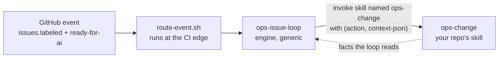
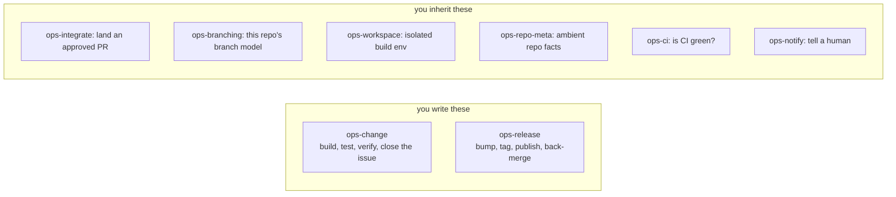
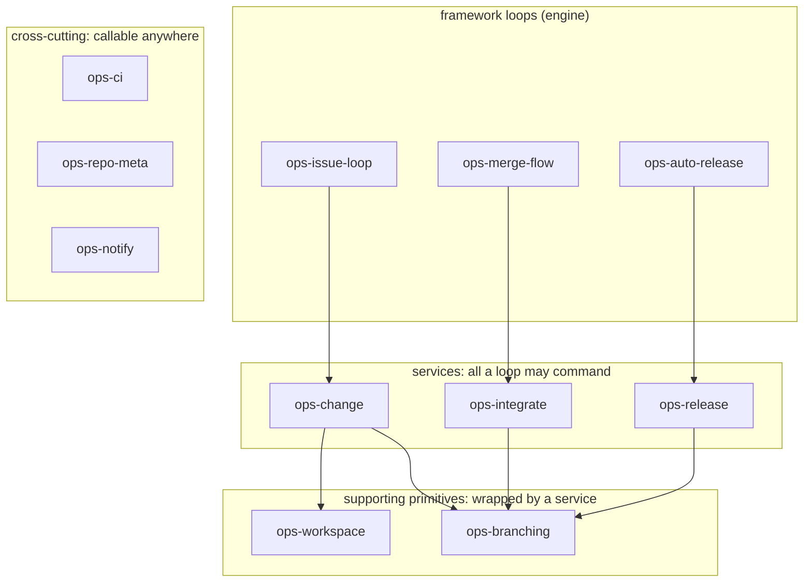

# umbraco-ai-ops

The **generic engine** for AI-driven issue automation across Umbraco products. It turns a
`ready-for-ai` GitHub backlog into CI-green, reviewed, merged PRs. It also feeds what it learns
back into the repos it works on.

This repo is product-**agnostic**. It knows *how to run the loop*. It does **not** know how to
build any one product. Each consumer supplies two things:

1. a **build skill**: the per-issue how-to for that product. The repo owns it.
2. a small **config block**: where issues live, where PRs open, which CI.

The engine holds no build steps of its own. It finds the repo's build skill by name, using the
`playbook` config key, and follows it. The repo owns and edits that skill. Nothing is injected
into a slot, and nothing relies on one skill shadowing another by name.

Extracted from the [`umbraco-mcp-ops`](https://github.com/hifi-phil/umbraco-mcp-ops)
prototype, which proved the model on Claude Code web routines.

## Who consumes it, and how

Consumer shape follows **repo cardinality**:

| Consumer | Shape | Where its build skill + config live |
|----------|-------|----------------------------------|
| **Umbraco.Forms** | single product, one repo | committed in the repo's own `.claude/skills/` (in-repo) |
| **Umbraco.Automate** | single product (multi-package), one repo | committed in the repo's own `.claude/skills/` (in-repo) |
| **MCP server family** | many repos, one toolchain | one shared consumer repo (`umbraco-mcp-ops`), delivered like the engine |

> **One product = one repo → consumer half lives in-repo.**
> **One product family = many repos → consumer half lives in one shared repo**, to avoid
> duplicating an identical build skill across the family.

## Plugins

Installed from this marketplace (`.claude-plugin/marketplace.json`):

| Plugin | What it is |
|--------|------------|
| **ops-setup** | Onboarding. `/umbraco-ops-setup` detects the repo's branching, CI and release setup, confirms it with you, then writes `.claude/ai-ops.yml`, a build-skill scaffold and the caller workflows. Run it first. |
| **issue-loop-core** | The orchestrator: queue, dispatch up to three at once, review, stop. It owns sequencing only, and follows the repo's build skill for the work itself. Bundles `rework-loop`. |
| **github-ops** | All GitHub work, in both environments: `gh`/`git` locally, `mcp__github__*` on web. Also wraps the CI provider, either `github-checks` or `azure-pipelines`. Every loop needs it. |
| **loop-dispatch** | The event router, `route-event.sh`. One routine per repo. It can work in a different repo from the one that fired the event, which is what Forms needs. |
| **merge-flow** | Merges a PR labelled `auto-merge`, once CI is green and there are no conflicts. |
| **learning** | Self-learning. Capture hooks file `proto-learning` issues, and `triage-learnings` turns them into PRs. The mechanism is generic. Where they go is config. |
| **release-flow** | Branching, release and dev-sync, for gitflow or main-only. **A default only.** Forms and Automate both supply their own release skills instead. |
| **dotnet-web-runtime** | Cloud setup so a .NET product can run as a web routine. Fixes the NuGet feed 401. |

## Getting started (onboarding a repo)

1. **Install the engine** in the target repo's workspace:
   `/plugin marketplace add umbraco/umbraco-ai-ops`, then install the plugins.
2. **Run `/umbraco-ops-setup`.** It reads the branching model out of git history, works out the
   CI host and release approach, then asks you about anything it could not tell. It writes
   `.claude/ai-ops.yml`, a build-skill scaffold and the caller workflows.
3. **Do the manual steps it lists.** Create the labels. Add the CI credentials and egress. On
   `azure-pipelines` repos that means a read-only ADO PAT. Then stand up the routine with
   `new-loop-routine`.
4. **Fill in any build-skill TODOs, then review and commit** the generated files.

Nothing in the engine is product-specific. Whatever your repo does differently lives in its own
`.claude/ai-ops.yml`. If your release or branching is unusual, it lives in a skill you own, named
in `branching.release_skill`.

## How a consumer links to the engine

Two things do the linking: a **config pointer** and a **skill name**. `issue-loop-core` finds the
repo's build skill through the `playbook` key in `ai-ops.yml`. Everything reaches `github-ops` by
its name. Nothing is copied, and nothing depends on one skill shadowing another.

- **Local:** run `/plugin marketplace add umbraco/umbraco-ai-ops`, then install the engine
  plugins. A repo's own skills load automatically as project skills. The MCP family loads its
  shared skills from `umbraco-mcp-ops`.
- **Web routines**, the main runtime: `scripts/cloud-skill-sync.sh` runs as the environment Setup
  script and delivers the engine to `$HOME/.claude/skills`. Single-product repos need nothing
  extra. A routine picks up the checked-out repo's `.claude/skills/` and its
  `.claude/settings.json` hooks on its own.

> **Watch out:** a routine clones the **default branch** unless its prompt says otherwise. So keep
> one build skill on the default branch and have it work out the base branch at runtime. Do not
> fork a copy per branch.

## The config contract

Each consumer supplies a **build skill** it owns, plus a **config block**: the repo's
`.claude/ai-ops.yml`. Its shape is set by **[`ai-ops.schema.json`](ai-ops.schema.json)**, and
**[`ai-ops.example.yml`](ai-ops.example.yml)** is a worked example. `/umbraco-ops-setup` writes it
and every loop reads it.

It covers `repos` (source, inbox, issue_link), `ci` (provider plus ADO org and project),
`branching` (model, base, release_base, merge_strategy, release_skill), `learning`, and the
`playbook` name. Leave out anything the engine can detect for itself. A plain same-repo gitflow
repo needs almost nothing. Anything unusual is handed to the skill named in
`branching.release_skill`.

## Where this is going: capability skills

> **This is the target, not what ships today.** The config contract above is what the engine does
> now. **Convention** is replacing it: each extension point becomes a skill named
> `ops-<capability>`, found by that name instead of by a config pointer.
> The plan, the phases and the open decisions are in
> **[`docs/capabilities-migration-plan.md`](docs/capabilities-migration-plan.md)**. Shared terms
> are in **[`docs/vocabulary.md`](docs/vocabulary.md)**.

### It's one interface

A generic loop reaches your repo by **invoking a skill by name**. That's the whole binding:



The skill's **name** is the address. The **action** is the verb. JSON goes in and facts come back.
There is no frontmatter to key on, no registry and no config pointer. Everything below is
commentary on that one arrow.

### You write two of them



Only `ops-change` and `ops-release` are **always** yours. Nobody else can write them, because they
are what your product actually does. The other six ship as engine defaults. Override one only when
you need something different. Learnings capture is engine machinery, not a per-repo capability.

| Capability | What it does | Provided by |
|---|---|---|
| `ops-change` | build/test/verify one change, close the issue | **always the repo** |
| `ops-release` | version bump, tag, publish, back-merge | **always the repo** |
| `ops-integrate` | land an approved PR: the gates, then the merge | engine default |
| `ops-branching` | open/merge PRs, start branches, own the branch model | engine default |
| `ops-workspace` | prepare + tear down an isolated build env | engine default |
| `ops-repo-meta` | ambient facts: identity, which repo fills which role | engine default, detection-backed |
| `ops-ci` | CI status + failing-build logs | engine default per CI provider |
| `ops-notify` | notify a human | engine default |

### Who may call what

Capabilities are not a flat pool. Each one is exposed to a particular layer, and the engine records
which, so review can hold the line:



**The missing arrows are the point.** Nothing reaches `ops-branching` except through a service. So
no loop ever holds a branch name or a merge strategy. It asks for an outcome, "merge this PR", and
branching decides how. That one absence is what collapses the four places base-branch knowledge
lives today.

The capability set is settled, and so is who may call what. The individual *actions* are still being
argued out against the catalog, so they live in the plan until `catalog.json` exists.

## Layout

```
.claude-plugin/
  marketplace.json         # marketplace manifest listing the plugins
.github/workflows/
  tests.yml                # hermetic CI gate: run every *.test.sh + jq-validate every JSON
  loop-dispatch.yml        # reusable runtime workflow consumers call (edge router -> fire routine)
plugins/
  <plugin>/                # one dir per plugin (skills/, agents/, scripts/, references/)
scripts/
  cloud-skill-sync.sh      # cloud-env Setup script: deliver the engine skills to a routine
```

## Status

**Work in progress.** Two jobs at once: pulling the proven `umbraco-mcp-ops` plugins out and making
them generic, and moving from the config contract to the capability model above. The design, the
phases, the open decisions and the hazard register are all in
**[`docs/capabilities-migration-plan.md`](docs/capabilities-migration-plan.md)**.
