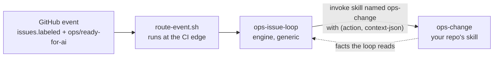
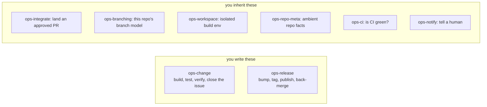
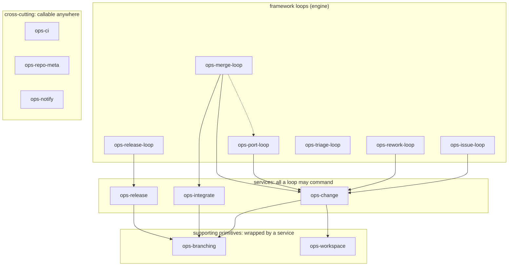

# umbraco-ai-ops

**DevOps for agents.**

The **generic engine** for AI-driven issue automation across Umbraco products. It turns a
`ops/ready-for-ai` GitHub backlog into CI-green, reviewed, merged PRs. It also feeds what it learns
back into the repos it works on.

This repo does not care which product it is used for. It knows *how to run the loop*. It does
**not** know how to build any one product. Each **consumer** (the repo that uses this engine)
supplies **two skills it owns**:

1. **`ops-change`**: build, test and verify one change, and close the issue behind it.
2. **`ops-release`**: bump, tag, publish, put the branches back in step.

The engine holds no build steps of its own. A loop reaches your repo by **invoking a skill by
name**, for example `ops-change`. It hands that skill an action, plus a small package of details
called a context. Nothing is injected into a slot. Nothing relies on one skill secretly standing
in for another skill with the same name. There is no config pointer either. Six more
**capabilities** (jobs the repo can customise) ship as defaults. You inherit them, and can
override them the same way.

Extracted from the [`umbraco-mcp-ops`](https://github.com/hifi-phil/umbraco-mcp-ops)
prototype, which proved the model on Claude Code web routines.

## Who consumes it, and how

How a consumer is shaped depends on one thing: how many repos its product uses. (The technical
term for this is **repo cardinality**.)

| Consumer | Shape | Where its capability skills live |
|----------|-------|----------------------------------|
| **Umbraco.Forms** | single product, one repo | its own `.claude/skills/ops-change` + `ops-release` |
| **Umbraco.Automate** | single product (multi-package), one repo | its own `.claude/skills/`, same shape |
| **MCP server family** | many repos, one toolchain | **not supported yet**, see below |

> **One product, one repo: your two skills live in that same repo.** That is the shape the engine
> supports today. Both single-repo consumers will use it. Neither one has written its two skills
> yet.

**The many-repos-one-toolchain shape is on hold.** A lot of products would want one toolchain
serving a whole family of repos. The `umbraco-mcp-ops` prototype **already solved this**. So
there is working code to copy from, not a blank page. It has not yet been rebuilt to fit the
naming rule this engine uses now. That needs input from whoever owns that family of repos.
The reasoning, and when to pick this back up, are in
**[the plan, §6.10](docs/capabilities-migration-plan.md#610-the-repo-family-consumer-shape--deferred-not-designed)**.

The one feature that assumes a family of repos is triage's `shared-skills` destination. On a
single-repo consumer, the skill says only `code` and `loop-self` are live. It chooses to **hold**
a lesson rather than file it in the wrong place. So a family lesson stays an open
`ops/proto-learning` issue for a human to handle. Nothing is lost, but the skill does not say
where such a lesson *should* go on a single repo. That is a known small gap, not a safety net.

## Plugins

Installed from this marketplace (`.claude-plugin/marketplace.json`):

| Plugin | What it is |
|--------|------------|
| **ops-install** | Onboarding, and the proof it worked. `/ops-install` first checks its own version is current, then detects the repo's setup, writes the few facts detection can't reach to `.claude/ops-repo-meta.json`, reports capability coverage, scaffolds a stub for anything missing, interviews you to fill that stub's TODOs, creates every `ops/` label on the repo its role implies, installs the caller workflows and validates the routing. Seven of its ten steps are scripts. Run it **second**. |
| **ops-preflight** | Scores whether a repo is worth wiring up, before you run `/ops-install`. See [Checking readiness](#checking-readiness-before-onboarding-a-repo). Run it **first**. |
| **ops-issue-loop** | The orchestrator: queue, dispatch up to three at once, stop at a green PR. It owns sequencing only and commands your `ops-change` for the work. Bundles `ops-rework-loop` (review feedback) and `ops-port-loop` (one merged change, a PR per other live line, none of them landed). |
| **ops-learnings** | Self-learning. Read-only hooks file `ops/proto-learning` issues off the critical path; `ops-triage-loop` sweeps them weekly and routes each lesson to whoever owns it. |
| **github-ops** | All GitHub work, in both environments: `gh`/`git` locally, `mcp__github__*` on web. Also wraps the CI provider, either `github-checks` or `azure-pipelines`. Every loop needs it. |
| **loop-dispatch** | The event router, `route-event.sh`. One routine per repo. It can work in a different repo from the one that fired the event, which is what Forms needs. |
| **ops-capabilities** | The six capability skills you **inherit**: `ops-integrate`, `ops-branching`, `ops-workspace`, `ops-repo-meta`, `ops-ci`, `ops-notify`. Override one by shipping your own skill of the same name. |
| **ops-merge-loop** | Sweeps PRs labelled `ops/auto-merge` and hands each to `ops-integrate · land`. Scheduling only: every merge gate lives in the service. |
| **ops-release-loop** | Issue-triggered, CI-gated release. Commands the repo's own `ops-release` through plan -> cut -> publish -> sync, with an Opus pre-publish review as the second gate. |

> **Not built yet, and not declared:** **dotnet-web-runtime** (cloud setup so a .NET product can
> run as a web routine, fixing the NuGet feed 401). It used to be listed in `marketplace.json`
> while pointing at a directory that did not exist, which would make `/plugin marketplace add`
> fail on the whole marketplace. It is re-declared when it exists.

## Checking readiness (before onboarding a repo)

This runs before `/ops-install`, so it sits here first.

`ops-preflight` answers a different question than `/ops-install`. Onboarding answers whether the
loops will *run* here, because its coverage check matches skill names. This answers whether the
loops will do **good** work here, which is a fact about the product, not about which skills exist.

It reads three layers, merged in this order: an engine base of checks, a **stack** profile that
matches the repo (`dotnet`, `node`, or both), and the repo's own
`.claude/ops-preflight-profile.json` override.

It never runs your build. That ceiling is deliberate: it keeps the check working on any machine,
including one that cannot compile the product.

Three verdicts, never two: `present`, `gap`, and `unknown`. Silence is never a pass: a check
nobody could answer reports `unknown`, not a pass and not a fail. Only a human can set `gap`;
detection alone can only report `present` or leave a check `unknown`.

Evidence strength decides how a `present` is reached. A strong match is named for, or dedicated
to, the exact job the check asks about, and resolves straight to `present` with the evidence
shown: a script literally named `build.sh` satisfies a build check on sight. A weak match only
proves something exists, not that it does that job, and asks instead: a generic `package.json`
proves a package exists, not where the published version lives, so the check prints `ASK` with
what it found and counts as `unknown` until a person answers.

The report groups every check under one of nine fixed sections, always in this order: release
management, testing, harness, environment, frontend, backend, best practices, utilities, misc.
Release management and testing come first because they are what unlock the merge and release
parts of the pipeline.

Only a human can turn an `unknown` into a `gap`. The interview asks about everything the files
could not answer, in that same section order.

The score is a letter grade, weighted so a check needed for the loops to work counts more than
one that only makes them better. It refuses to grade while any check is still `unknown`, because
`unknown` means detection could not see something, not that it is missing.

Run it with `/ops-preflight`. It blocks nothing: a repo can onboard with gaps open and close them
afterwards.

## Getting started (onboarding a repo)

Run `ops-preflight` first: it checks whether a repo is worth wiring up before you run
`/ops-install`.

> **No prerequisite on this repo.** It is **public**, so a consumer needs nothing from it. The
> reusable workflow resolves, and a cloud environment clones it anonymously.
>
> This block used to describe two failures caused by the repo being private. One: Actions
> refused to read a reusable workflow out of it (*"workflow was not found"*, before any job
> starts, so no logs). Two: a cloud environment built with no skills unless `OPS_TOKEN` was set.
> **Both are gone, and so is the token.** If the engine is ever made private again, both come
> back. The fixes are an org-access setting plus a token in every environment.

1. **Install the engine** in the target repo's workspace. This is two separate steps. Adding the
   marketplace only registers the catalogue. It installs nothing:
   ```
   /plugin marketplace add umbraco/umbraco-ai-ops
   /plugin install ops-install@umbraco-ai-ops
   /plugin install ops-capabilities@umbraco-ai-ops
   /plugin install github-ops@umbraco-ai-ops
   ```
   Those three are what onboarding needs. They give you the installer, the six defaults it
   reports as `inherited`, and the skill that does the label writes. Add `loop-dispatch`,
   `ops-issue-loop`, `ops-merge-loop`, `ops-release-loop` and `ops-learnings` before you run a
   loop. `/plugin` on its own opens a menu if you would rather click.

   > **The command includes the plugin's name (this is called being namespaced).** So it is
   > **`/ops-install:ops-install`**, not `/ops-install`. Same for the loops.
2. **Run `/ops-install`.** It reads the branching model out of git history, and works out the CI
   host and release approach. Then it asks about anything it could not tell. It then:
   - writes the few facts nothing can detect to `.claude/ops-repo-meta.json`, and validates it,
   - reports **capability coverage** and scaffolds a stub for whatever is missing (on a fresh
     repo that is `ops-change` and `ops-release`, the two that are always yours),
   - **creates every `ops/` label**, on the repo each one's role implies,
   - installs the caller workflow on every repo that fires events.
3. **Do what is genuinely left.** Add the two routine secrets, and the CI credentials if CI is
   not GitHub checks. Turn on `allow_update_branch`. Then stand up the routine with
   `new-loop-routine`.
4. **Fill in the TODOs in the scaffolded skills, then review and commit.** A scaffold is not an
   implementation: the loops cannot run until those are done.

Nothing in the engine is product-specific. Whatever your repo *does* differently lives in a
skill you own named `ops-<capability>`. The handful of things it *is* differently are declared in
`.claude/ops-repo-meta.json`.

## How a consumer links to the engine

**One thing does the linking: the skill's name.** `ops-issue-loop` invokes `ops-change`.
`ops-release-loop` invokes `ops-release`. Everything reaches `github-ops` by its name. Nothing is
copied. Nothing depends on one skill secretly standing in for another skill with the same name
(what's sometimes called shadowing). And no pointer has to be kept in step, because there is no
pointer.

- **Local:** run `/plugin marketplace add umbraco/umbraco-ai-ops`, then install the engine
  plugins. A repo's own skills load automatically as project skills.
- **Web routines**, the main runtime: paste **`scripts/cloud-setup-stub.sh`** into the
  environment's **Setup script** field. **That is the whole setup: no variables, no token.** The
  stub clones the engine anonymously and runs `scripts/cloud-skill-sync.sh`. That script delivers
  every skill and agent to `$HOME/.claude`, and wires the capture hooks. A routine picks up the
  checked-out repo's own `.claude/skills/` and `.claude/settings.json` hooks by itself.

  > **To pick up a newer engine, bump the `# rebuild:` number in the stub and re-save.** The
  > environment snapshot only resets when that field's text changes. A stub that clones `main`
  > does not re-run just because this repo moved on.

> **Watch out:** a routine clones the **default branch** unless its prompt says otherwise. So keep
> one build skill on the default branch and have it work out the base branch at runtime. Do not
> fork a copy per branch.

## Capability skills

> **Where things stand.** The engine is **done**. The catalog exists. Routing runs in two layers.
> The engine ships base rules, and each repo can layer its own extra rules on top (an
> **overlay**). Both apply the moment an event first arrives. Every loop commands capabilities by
> name. All six framework defaults ship. The installer proves coverage and creates the labels.
> Evals (automated tests that check real behaviour, not just names) are generated from the
> catalog. And the old central settings file is deleted. What is left is work for each consumer:
> Forms' and Automate's
> own two skills (Phase 6). The plan is in
> **[`docs/capabilities-migration-plan.md`](docs/capabilities-migration-plan.md)**. Shared terms
> are in **[`docs/vocabulary.md`](docs/vocabulary.md)**.

### It's one interface

A generic loop reaches your repo by **invoking a skill by name**. That's the whole binding:



The skill's **name** is the address. The **action** is the verb. JSON goes in and facts come back.
There is no frontmatter (a file's metadata header) to key on, no registry and no config pointer.
Everything below is commentary on that one arrow.

### You write two of them



Only `ops-change` and `ops-release` are **always** yours. Nobody else can write them, because they
are what your product actually does. The other six ship as engine defaults. Override one only when
you need something different. Learnings capture is engine machinery, not a per-repo capability.

| Capability | What it does | Provided by |
|---|---|---|
| `ops-change` | build/test/verify one change, close the issue | **always the repo** |
| `ops-release` | version bump, tag, publish, back-merge | **always the repo** |
| `ops-integrate` | land an approved PR: the gates, then the merge | engine default |
| `ops-branching` | open/merge PRs, start branches, own the branch model | engine default |
| `ops-workspace` | prepare + tear down an isolated build env | engine default |
| `ops-repo-meta` | ambient facts: identity, which repo fills which role | engine default, detection-backed |
| `ops-ci` | CI status + failing-build logs | engine default per CI provider |
| `ops-notify` | notify a human | engine default |

### Who may call what

Capabilities are not all treated the same. Each one may only be called from a particular layer of
the system. The engine writes down which, so a review can check it:



**The missing arrows are the point.** Nothing reaches `ops-branching` except through a service. So
no loop ever holds a branch name or a merge strategy. It just asks for an outcome, such as "merge
this PR," and branching decides how. Today, knowledge about which branch is the base is spread
across four places. This one missing connection is what pulls that down to one place instead.

**Only service edges are drawn.** Every loop also reads the cross-cutting three, and drawing those
eighteen arrows would hide the shape. Two boxes therefore look sparse in the diagram, which is a
little misleading. `ops-triage-loop` commands **no** service at all: it routes lessons into issues
and drafted PRs, and touches nothing else. `ops-port-loop` reaches only `ops-change`, because it
deliberately has no landing path. The one dotted edge is the hand-off from `ops-merge-loop` to
`ops-port-loop`. That is a loop starting a loop, rather than commanding a capability. It is the
normal way a port begins. A port is cut from the merge commit and cannot exist before one.

### The actions each one answers to

The capability is the address. The **action** is the verb. These come from
**[`catalog.json`](catalog.json)**, whose shape is set by
**[`catalog.schema.json`](catalog.schema.json)**. The action *names* are the contract: a capability
skill must implement exactly these and reject anything else.

> The table below is **generated**. Edit `catalog.json`, then run
> `scripts/catalog-to-readme.sh`. CI fails if the two drift apart.

<!-- BEGIN GENERATED: catalog-actions (scripts/catalog-to-readme.sh) -->
<table>
<thead><tr><th>Capability</th><th>Action</th><th>What it does</th></tr></thead>
<tbody>
<tr><td rowspan="3"><code>ops-change</code></td><td><code>implement</code></td><td>Make the change the issue asks for on a work branch, and push it.</td></tr>
<tr><td><code>verify</code></td><td>Run this repo's build, tests and sanity checks against the change, and report pass or fail with enough detail for the caller to act on a failure.</td></tr>
<tr><td><code>close-issue</code></td><td>Told that a PR has landed, work out which issue it was for and close that issue only once EVERY target line has landed.</td></tr>
<tr><td rowspan="4"><code>ops-release</code></td><td><code>plan</code></td><td>Turn the trigger into release facts: which line, which version, and which units of work the release contains.</td></tr>
<tr><td><code>cut</code></td><td>Branch, bump the version files, write the changelog, and open the release PR.</td></tr>
<tr><td><code>publish</code></td><td>Realize the release once its PR has landed: tag the commit, push the artifacts to their feed, and publish the release notes.</td></tr>
<tr><td><code>sync</code></td><td>Put the line's branches back in step after a release, so the next change starts from what actually shipped.</td></tr>
<tr><td><code>ops-integrate</code></td><td><code>land</code></td><td>Check every gate, then merge, or decline with the reason.</td></tr>
<tr><td rowspan="3"><code>ops-branching</code></td><td><code>merge</code></td><td>Merge a PR using whichever strategy this repo's model calls for.</td></tr>
<tr><td><code>open-pr</code></td><td>Open a PR from a work branch onto the correct base for its line, choosing that base internally.</td></tr>
<tr><td><code>start-branch</code></td><td>Create a work branch for a change, named to this repo's convention and rooted on the correct base for its line.</td></tr>
<tr><td rowspan="2"><code>ops-workspace</code></td><td><code>prepare</code></td><td>Create the isolated workspace for a branch and leave it ready to build.</td></tr>
<tr><td><code>teardown</code></td><td>Remove the workspace and everything it created, including any database or container.</td></tr>
<tr><td rowspan="3"><code>ops-repo-meta</code></td><td><code>identity</code></td><td>Name the repo the loop is working in, and the labels and defaults it runs by.</td></tr>
<tr><td><code>topology</code></td><td>Say which repo fills each of the four roles: <code>code</code> (required), <code>issues</code>, <code>releases</code> and <code>learnings</code>.</td></tr>
<tr><td><code>lines</code></td><td>List the live lines in age order, say which is primary, and give the port order.</td></tr>
<tr><td rowspan="2"><code>ops-ci</code></td><td><code>status</code></td><td>Report the CI state of a PR: pending, green or red, and which checks produced that verdict.</td></tr>
<tr><td><code>log</code></td><td>Return the failing part of a failing build's log, trimmed to what is needed to diagnose it rather than the whole run.</td></tr>
<tr><td><code>ops-notify</code></td><td><code>send</code></td><td>Send one notification to a human through whichever channel this repo uses.</td></tr>
</tbody>
</table>
<!-- END GENERATED: catalog-actions -->

Each catalogued action also carries a worked `example` context. This does double duty: the
installer builds a starter file from it, and the evals are seeded from it too. What an action
*does* is not checked automatically anywhere. Nothing checks the shape of the code, and nothing
checks the data going in or out. The evals are the only thing actually checking behaviour, and
that is a deliberate trade-off in the design.

## Layout

```
.claude-plugin/
  marketplace.json         # marketplace manifest listing the plugins
.github/workflows/
  tests.yml                # hermetic CI gate: run every *.test.sh + jq-validate every JSON
  loop-dispatch.yml        # reusable runtime workflow consumers call (edge router -> fire routine)
catalog.json               # the capability catalog: capabilities, actions, worked examples
catalog.schema.json        # its shape (a deliberate superset of the conformance spec's keys)
docs/                      # migration plan, the two design docs, the vocabulary
evals/                     # GENERATED from the catalog: one suite per capability, opt-in
plugins/
  <plugin>/                # one dir per plugin (skills/, agents/, scripts/, references/)
scripts/                   # engine-wide scripts, not tied to one skill; each has its *.test.sh
  validate-catalog.sh      # enforce catalog.schema.json's rules in jq (hermetic CI has no validator)
  catalog-to-readme.sh     # regenerate this file's action table; --check fails on drift
  build-evals.sh           # regenerate evals/; --check fails on drift
  run-evals.sh             # run a suite (needs claude + a real repo, so NOT named *.test.sh)
  validate-manifests.sh    # plugin.json <-> marketplace.json agreement; no phantom entries
  validate-capability-skills.sh  # capability frontmatter: nothing that blocks the Skill tool
  cloud-setup-stub.sh      # THE thing you paste into a cloud env's Setup script field
  cloud-skill-sync.sh      # what the stub runs: delivers every skill + agent into the env
```

## Status

**The engine is complete.** Both jobs are done. The proven `umbraco-mcp-ops` plugins are pulled
out and made generic. The old settings-file approach is replaced by the capability model
described above. What remains is work in each consumer's own repo: each product's own `ops-change`
and `ops-release`. The design, the phases, the decisions, the deviations log and the hazard
register are all in **[`docs/capabilities-migration-plan.md`](docs/capabilities-migration-plan.md)**.
