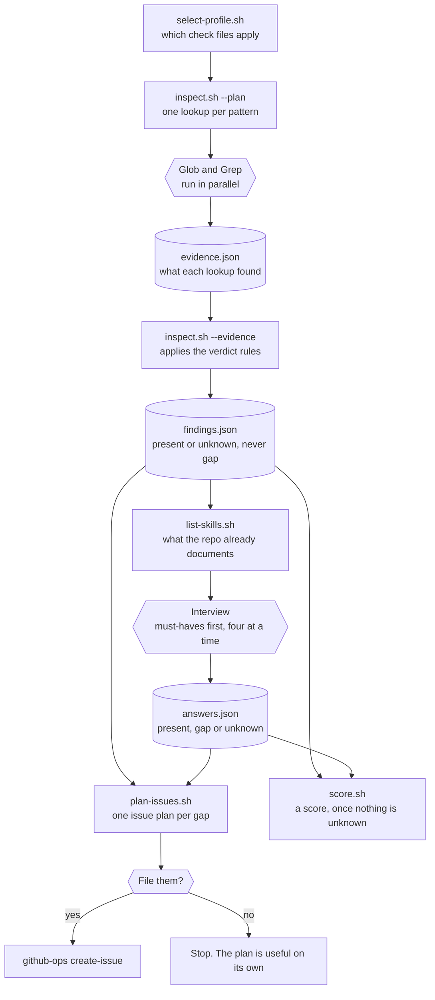

# `ops-preflight` — design

**Status:** approved 11-08-2026. Source: *AI Ops — Preparing your Harness for Automation*
(internal doc), turned from a flat checklist into a runnable one.

## The question it answers

`ops-install` answers *"will the loops run in this repo?"* — the wiring question. It can report
full coverage for a repo the loops will nonetheless do bad work in, because coverage matches
skill **names**, not the state of the product.

`ops-preflight` answers the other half: **is this repo in a state where the loops will produce
good work?** A repo with no test command, no isolated build, and an undocumented branch model can
be onboarded green and will still waste every run.

Run it **before** `/ops-install`. It never blocks.

## Shape

A plugin, `ops-preflight`, with one skill of the same name. It is **not a loop** (no `-loop`
suffix) and **not a capability** (it implements no catalog action). It sits in the same exempt
namespace as `ops-install`, and is listed in `catalog.json`'s `reserved_skill_names` for that
reason.

## The check model

Every check is **data**, not prose in a skill:

```json
{
  "id": "verify-test-command",
  "consumer": "ops-change · verify",
  "severity": "blocking",
  "title": "One command runs the tests",
  "why": "ops-change · verify has to report pass or fail with enough detail to act on. Without a single command that does it, verify becomes a prose recipe that drifts.",
  "detect": { "any_path": ["**/*Tests*.csproj"] },
  "ask": "What single command runs this repo's tests?"
}
```

| Field | Meaning |
|---|---|
| `id` | stable; the issue title and the answers file key both derive from it |
| `consumer` | which capability or plugin breaks without it, printed on every row alongside its `action` |
| `severity` | `blocking` (a capability cannot be written without it) or `quality` (the loops run, the output is worse) |
| `section` | one of the source checklist's nine headings; the report and the filed issues group on this, in a fixed order, not on `consumer` |
| `why` | one line, printed in the report and in the filed issue |
| `detect` | optional. Absent means the check can only be answered by a human |
| `signal` | optional. `true` inverts what a match means — see below |
| `ask` | optional. Absent means report it, never interview on it |

**Grouped by `section`, in a fixed order.** Release management and testing first, then harness,
environment, frontend, backend, best practices, utilities, misc last: release management and
testing are what unlock the merge and release parts of the pipeline, and are the two sections worth
doing first if someone only has time for one. Within a section, a `blocking` check sorts above a
`quality` one. `consumer` still prints on every row, saying what breaks, but it is no longer what
the report or the filed issues are ordered by.

**Severity reads as English, not as the raw word.** `blocking` and `quality` are unchanged as data
(nothing renamed them, and no other script that reads this data changed) but the report never
prints those words on their own. `blocking` shows as *Needed for the loops to work*, `quality` as
*Makes the loops better*, under a header saying this is a map of the repo and not an entry exam
that anyone clears every box of.

### Three verdicts, never two

| Verdict | Set by |
|---|---|
| **present** | detection matched, or the human confirmed it |
| **gap** | the human said it is not there |
| **unknown** | detection found nothing and nobody has been asked |

**Silence is never a pass.** A check detection cannot see stays `unknown` until a human resolves
it, and `present (declared)` is printed differently from `present (detected)` — a self-reported
yes must never read as evidence. This is the same rule as *a gate that cannot run reports
blocked*: an unrunnable check reports `unknown`, not a pass.

### `signal` — when finding the file is the bad news

Added after a dry run, not designed up front. `dotnet-private-feed` detected a `NuGet.config` and
reported **present** for *"a restore in a fresh worktree needs no credential"* — a false pass on a
**blocking** check, for exactly the repos most likely to fail.

A `signal: true` check inverts the match: finding the file is a reason to **ask**, never a pass.
It reports `unknown` with `source: signal` and **keeps its evidence**, so the interview can open
with what was found rather than asking blind. A signal check must carry an `ask`; `inspect.sh`
rejects one without, because nothing could ever resolve it.

This is the same idea as `ops-install`'s `override_signals` — *a signal is a hint, not a verdict*.

## Generic base, stack profiles, repo override

Three layers, merged by `id` — later wins:

| Layer | File | Ships |
|---|---|---|
| base | `scripts/checks.json` | engine. Product-agnostic wording only |
| stack | `scripts/profiles/<stack>.json` | engine. Selected by its own `when` block. **All** matching profiles load |
| repo | `<repo>/.claude/ops-preflight-profile.json` | the consumer. Overrides and adds |

Profiles are named for a **stack** (`dotnet`, `node`), never for a product. No product name and no
tool name ships in the engine: a profile detects `package.json` and `*.sln`, not the commands
people run against them. A genuinely product-shaped check — *"the demo script installs our CMS"* —
belongs in the repo's own override file.

The Umbraco-specific items in the source doc survive by being worded as a **need**:
*"a script stands up a running instance of the product"*, *"several instances can run at once
without port or database collisions"*. True of every product, concrete enough to check.

### Detection grammar

Deliberately tiny. A check is `present` if **any** rule matches:

- `any_path` — array of globs, relative to the repo root
- `any_file_contains` — array of `{ glob, pattern }`, matched with `grep`

Nothing else. Detection is a seed, not an authority — the same stance `ops-install`'s `detect.sh`
takes.

Evidence for a match is capped at three paths in the report; a match beyond that still counts but
prints as `(+N more)` rather than vanishing, so a check that legitimately matches dozens of files
does not bury the row it belongs to.

### Pruning the scan before it starts

`scripts/prune.json` is a third data file alongside the checks and the profiles, read by
`select-profile.sh` and `inspect.sh` before either walks the repo tree, with an `OPS_PREFLIGHT_PRUNE`
env override that replaces the list wholesale (no per-repo layering, unlike checks and profiles).
Added after a dry run found evidence pointing straight into `.claude/worktrees`: the engine's own
`ops-workspace` default puts a throwaway checkout there per change, and an unpruned scan was
answering every check about that copy of the repo rather than the one being inspected. `.claude`
itself stays readable: `.claude/skills/*` is real evidence several checks depend on
(`release-prepare`, `release-cleanup`, `general-pattern-mining`); only the worktrees subtree under
it is pruned.

## Flow

Rectangles are this plugin's scripts, hexagons are work the harness or a human does, and cylinders
are the files passed between them. Nothing here is stored: every file is temporary to one run.



Two things the picture is meant to make obvious. **Only the interview can produce a `gap`**, which
is why `findings.json` says `present or unknown` and `answers.json` is the first place `gap`
appears. And **both `plan-issues.sh` and `score.sh` take the findings AND the answers**, because an
answer overrides what detection saw and a check nobody answered keeps whatever verdict it had.

- **`inspect.sh` never runs your build.** It reads files. Hermetic — `bash` + `jq` — so it works
  on a machine that cannot compile the product, and it is safe in CI.
- **The looking is done by the harness's own Glob and Grep, through `--plan` and `--evidence`.**
  `--plan` says what to look for, the skill runs those lookups in parallel with the built-in tools,
  and `--evidence` applies the same verdict rules to what came back. Every path is checked against
  the pattern that asked for it first, so a stray result changes nothing.
  - **Why:** the script's own path restarts a program per pattern, about 1,400 of them, at roughly
    26ms each on Windows. That is the whole of its half-minute runtime; replacing the match loop
    with grep, cutting jq calls, and shrinking the file list sixteenfold each changed nothing
    measurable, which is what proves it. It also makes the step visible, because tool calls appear
    as they happen where a shell command is silent until it ends.
  - **`inspect.sh <repo>` alone still works and is the reference.** It needs no harness, it is what
    the hermetic tests exercise, and the two paths are asserted to produce identical findings. If
    they ever disagree, the script is right.
- **Glob patterns are the standard language**, the one the Glob tool and `.gitignore` use: `**`
  reaches into folders, a single `*` does not. It used to be a private dialect where a bare `*`
  crossed `/`, which read fine and hid the same bug twice (`playwright.config.*` and `version.json`
  both silently matched the root only). It is also what lets `--plan` hand a pattern to the Glob
  tool untranslated, so there is one language and nothing to keep in step.
- **`list-skills.sh` reads what the repo already documents about itself**, before a single question
  is asked: the name and description of every skill and agent under `.claude/`, plus how many of
  them are the engine's own, which is how a part-onboarded repo announces itself. A description is a
  claim, never a verdict, so it resolves nothing; it names the thing so the question can be asked
  properly. A live repo's `repo-setup`, `session-hook-config` and `demo-site-management` skills each
  described the answer to a question that was asked anyway.
- **The interview is batched, four questions per `AskUserQuestion` call, seeded from what
  `inspect.sh` found.** Four is the tool's own hard limit, not a choice: there is no call that asks
  everything. A question detection has already answered is never asked.
- **Must-haves first, then stop and offer the rest.** Every `blocking` question, then a pause and a
  count of the `quality` ones left, as an optional second sitting. A live run asked eighteen in one
  go, which is more than anyone answers well.
- **An *"I do not know"* answer triggers one targeted look, never an assumption.** The check's own
  `detect` patterns say where to look; what turns up is handed back to the person, who still
  decides. Two of three unknowns in a live run were a lint script and a `CLAUDE.md` link sitting in
  files nobody had opened.
- **Every check carrying a severity carries an `ask`.** Without one it can never leave `unknown`,
  and since `score.sh` refuses to score while anything is unknown, one silent check blocks the score
  for that repo forever. `inspect.test.sh` asserts it.
- **The prose is written for someone who has installed nothing yet.** No capability name, no
  catalog, no "framework default" in a `title`, `why` or `ask`; those leak straight into the
  generated question options, which is how `ops-change` ended up in front of a first-time reader.
  Asserted in `inspect.test.sh` alongside the product-name sweep.
- **Issue titles are stable** (`ops-preflight: <title>`), so a re-run finds the existing issue and
  files nothing. Gaps are labelled `ops/preflight`, created idempotently before the first file.
- **`score.sh` refuses to score while any check is still `unknown`.** Unknown means detection could
  not see it, not that it is missing; scoring a raw scan would hand a well-prepared repo a low
  number for having files this tool cannot read. It scores only once every check reads `present` or
  `gap`: `blocking` weighs 3, `quality` weighs 1, and the score is the weight of what is `present`
  over the weight of everything.
- **No letter grade.** There was one, an `A*` to `F` band table with a hard cap at `C`, and it was
  removed on purpose: a letter reads as a verdict on the people who built the repo, which is the one
  thing this report must never be. The cap is now a plain sentence printed beside the number
  whenever a blocking check is a `gap`, so a high percentage still cannot let quality polish paper
  over something the loops actually need.

## What it does not do

- **Does not run builds, lints or tests.** Real evidence, but it needs a working local toolchain
  and fails on machines that cannot build the product. `inspect.sh` would stop being usable
  anywhere.
- **Does not commit a report file.** It would be stale the moment somebody fixed something.
- **Does not block `ops-install`.** Advisory only; `ops-install` gains one pointer line. A repo is
  allowed to onboard with gaps and close them afterwards.
- **Does not score a raw scan.** `score.sh` refuses to turn a repo's `present` / `gap` / `unknown`
  mix into a percentage until the interview has resolved every `unknown`, and even then a blocking
  `gap` is called out in words beside the number: a percentage is never allowed to let quality
  polish paper over something the loops actually need.
- **Does not hand out a letter grade.** Removed after it shipped, for the reason above.

## Knock-ons

| Change | Why |
|---|---|
| `catalog.json` → `reserved_skill_names` gains `ops-preflight` | a repo must not ship a skill of that name and shadow it |
| CLAUDE.md seam table gains a row | the check catalog is a data + schema seam like the others |
| CLAUDE.md label list gains `ops/preflight` | every engine-owned label is listed there. Non-triggering: nothing routes on it |
| `.claude-plugin/marketplace.json` gains an entry | a marketplace entry is what makes the plugin installable |
| `ops-install` SKILL.md gains a pointer | otherwise nothing tells anyone this exists |
