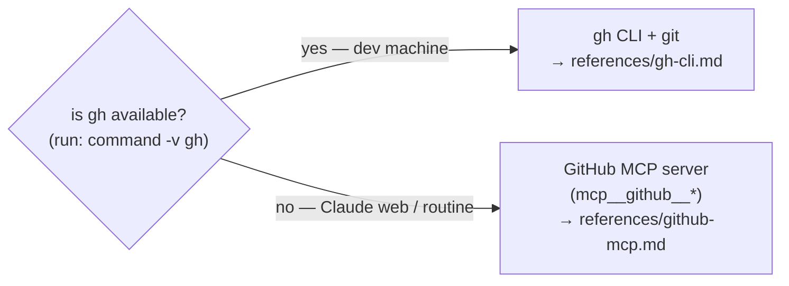

# github-ops

The loops in this marketplace run in **two environments**, and GitHub is reached
differently in each. This skill is the single source of truth for that mapping so no
loop skill has to repeat it.

## Pick the mechanism by environment

- **Local (dev machine):** `gh` and `git` are installed → use
  [`references/gh-cli.md`](references/gh-cli.md). Auth is your `gh` login.
- **Claude web / scheduled routine:** `gh` is **not** available; the **GitHub MCP
  server** is → use [`references/github-mcp.md`](references/github-mcp.md). Auth is
  the MCP server's connected GitHub App (no token to paste).

Both are first-class. Detect with `command -v gh` (or: if the `mcp__github__*` tools
are present, you're on the MCP path). **Bash scripts** under `scripts/` are a third,
separate case — they call the REST API with `curl` directly and are out of scope
here.

> The MCP reference uses the tool names from the current `github/github-mcp-server`.
> Server versions differ — **confirm against the live `mcp__github__*` tool list**
> and use the tool that performs the operation if a name doesn't match.

## The operation catalog

Every operation a loop needs, with its section anchor in each reference file. Both
files cover the **same** list — keep them in sync.

| Operation | Used by |
|-----------|---------|
| List issues (by label / state) | triage (inbox), all loops (backlog) |
| Get / read an issue | triage |
| Create an issue | triage (`mcp-repo`, `loop-improvement`) |
| Comment on an issue | all loops |
| Add / remove a label on an issue | triage, merge-flow |
| Close an issue | triage |
| List PRs (by label / state) | merge-flow |
| List a repo's open Dependabot PRs | dependabot-rollup |
| List Dependabot security alerts | dependabot-rollup |
| Get a PR (review decision, mergeable, base) | merge-flow, all loops |
| Get PR reviews + review comments | merge-flow, review-response |
| **Get PR CI / check-run status** | every loop (the merge gate) |
| **Read a failing check's log** | every loop (diagnosing a red CI run) |
| Re-request review / add reviewer | review-response |
| Create a PR | all loops |
| **Merge a PR (+ delete branch)** | merge-flow |
| Update a PR's body | dependabot-rollup |
| **Close a PR without merging (+ comment, delete branch)** | dependabot-rollup |
| Create a branch | triage (shared-skills), issue-loop (web path) |
| Create / update / push file(s) | triage (shared-skills), issue-loop (web path) |
| Get file contents | any |
| Detect base branch | all (defer to `release-and-branching`) |

## CI provider — GitHub checks vs Azure Pipelines

Two operations above — **Get PR CI / check-run status** and **Read a failing check's
log** — depend on *which CI system the repo uses*, not on the GitHub mechanism. Resolve
them by the consumer's `ci_provider`:

- **`github-checks`** (default) — CI is GitHub Actions / checks on the PR. Use the CI
  rows in [`gh-cli.md`](references/gh-cli.md) / [`github-mcp.md`](references/github-mcp.md).
- **`azure-pipelines`** — CI runs in Azure DevOps, triggered by the push but reported
  outside GitHub's check API. Use [`references/azure-pipelines.md`](references/azure-pipelines.md).

Everything else in the catalog (issues, PRs, branches, files, merge) is **always GitHub**
regardless of `ci_provider` — Azure-Pipelines consumers (Forms, Automate) keep their
PRs/issues on GitHub and only their *CI reads* go to Azure. So on an `azure-pipelines`
repo you use the GitHub mechanism (gh / MCP) for every row **except** those two CI rows,
which use the Azure reference.

## Rules that hold in both mechanisms

These are policy, not mechanism — they apply whichever reference you use:

- **Never merge without green CI + approval** (poll status; don't rely on an
  auto-merge that bypasses the gate). See `merge-flow`.
- **Never force-push; never edit a protected branch directly.**
- **On the web, no local clone** — create the branch and push file contents through
  the MCP server; you don't have a working tree.
- Branch model / base branch is **detected via `release-and-branching`**, not assumed.
