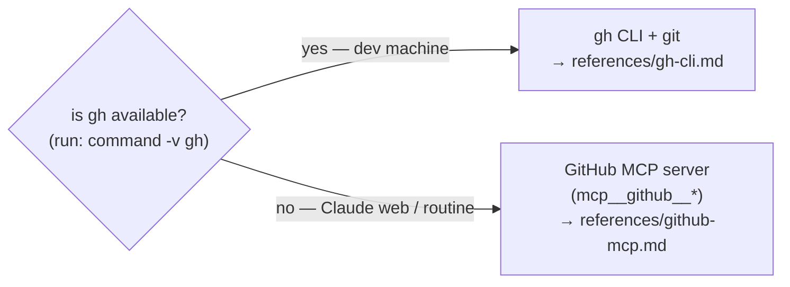

# github-ops

The loops in this marketplace run in **two environments**, and GitHub is reached
differently in each. This skill is the single source of truth for that mapping so no
loop skill has to repeat it.

## Pick the mechanism by environment

- **Local (dev machine):** `gh` and `git` are installed → use
  [`references/gh-cli.md`](references/gh-cli.md). Auth is your `gh` login.
- **Claude web / scheduled routine:** `gh` is **not** available; the **GitHub MCP
  server** is → use [`references/github-mcp.md`](references/github-mcp.md). Auth is
  the MCP server's connected GitHub App (no token to paste).

Both are first-class. Detect with `command -v gh` (or: if the `mcp__github__*` tools
are present, you're on the MCP path). **Bash scripts** under `scripts/` are a third,
separate case — they call the REST API with `curl` directly and are out of scope
here.

> The MCP reference uses the tool names from the current `github/github-mcp-server`.
> Server versions differ — **confirm against the live `mcp__github__*` tool list**
> and use the tool that performs the operation if a name doesn't match.

## The operation catalog (the provider interface)

The canonical list of operations a loop can invoke by name is **data, not prose**:
[`operation-catalog.json`](operation-catalog.json) (shape:
[`operation-catalog.schema.json`](operation-catalog.schema.json)). It's the **interface**
every provider implements — each operation carries an `axis`:

- **`forge`** — the git host. Implemented by [`gh-cli.md`](references/gh-cli.md) (local) and
  [`github-mcp.md`](references/github-mcp.md) (web). Both cover **every** `forge` operation —
  keep them in sync with the catalog.
- **`ci`** — the CI system. Implemented per the consumer's `ci_provider` (see below):
  GitHub checks live in the `gh-cli`/`github-mcp` CI rows; Azure Pipelines in
  [`azure-pipelines.md`](references/azure-pipelines.md).

Operations flagged `"gate": true` (`get-ci-status`, `read-failing-ci-log`, `merge-pr`) are
merge/CI gates — loops must never bypass them.

**Adding a provider** (a different git host, or a CI system beyond GitHub-checks / Azure
Pipelines): add a reference file that maps **every operation of that axis** in
`operation-catalog.json` to a concrete command/tool. The loops don't change — they call
operations by id.

## CI provider — GitHub checks vs Azure Pipelines

Two operations above — **Get PR CI / check-run status** and **Read a failing check's
log** — depend on *which CI system the repo uses*, not on the GitHub mechanism. Resolve
them by the consumer's `ci_provider`:

- **`github-checks`** (default) — CI is GitHub Actions / checks on the PR. Use the CI
  rows in [`gh-cli.md`](references/gh-cli.md) / [`github-mcp.md`](references/github-mcp.md).
- **`azure-pipelines`** — CI runs in Azure DevOps, triggered by the push but reported
  outside GitHub's check API. Use [`references/azure-pipelines.md`](references/azure-pipelines.md).

Everything else in the catalog (issues, PRs, branches, files, merge) is **always GitHub**
regardless of `ci_provider` — Azure-Pipelines consumers (Forms, Automate) keep their
PRs/issues on GitHub and only their *CI reads* go to Azure. So on an `azure-pipelines`
repo you use the GitHub mechanism (gh / MCP) for every row **except** those two CI rows,
which use the Azure reference.

## Rules that hold in both mechanisms

These are policy, not mechanism — they apply whichever reference you use:

- **Never merge without green CI + approval** (poll status; don't rely on an
  auto-merge that bypasses the gate). See `merge-flow`.
- **Never force-push; never edit a protected branch directly.**
- **On the web, no local clone** — create the branch and push file contents through
  the MCP server; you don't have a working tree.
- Branch model / base branch is **detected via `release-and-branching`**, not assumed.
